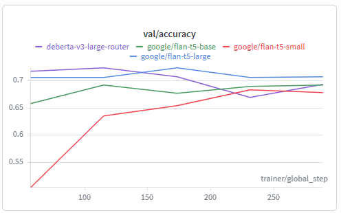

# Adaptive-RAG Reproduction Results

This file collects the final reproduction artifacts for the Adaptive-RAG paper and compares the paper-reported values against the locally generated results in this repository. The per-table markdown files are also available under 

[results/table_1.md](results/table_1.md), 

[results/table_2.md](results/table_2.md), 

[results/table_3.md](results/table_3.md), 

[results/table_4.md](results/table_4.md), 

[results/table_5.md](results/table_5.md),

[results/table_6.md](results/table_6.md).

## Reproduction Scope

The repository currently contains local outputs for the `flan_t5_xl`-based pipeline and the router-size sweep shown in Table 6. For rows where the paper numbers are not directly re-run in this environment, the original paper values are preserved and the local measurements are listed separately.

## Implemented Improvement

The implemented extension in this repository tested a DeBERTa router in place of the FLAN-series router. The hypothesis was that a discriminative encoder router would better capture query complexity and improve routing quality without relying on generative decoding. In the local experiments, that hypothesis did not hold: the DeBERTa router did not outperform the FLAN router family, so the final reported results keep the FLAN-series routers as the stronger local baseline.

## Validation Plot

The router training/validation curve is included here for reference: [results/val_graph.png](results/val_graph.png).

## Table 1. Average QA Results

| LLM | Type | Method | EM | F1 | Acc | Step | Time | Source |
| --- | --- | --- | --- | --- | --- | --- | --- | --- |
| FLAN-T5-XL (3B) | Simple | No Retrieval | 14.87 | 21.12 | 15.97 | 0.00 | 0.11 | Paper |
| FLAN-T5-XL (3B) | Simple | Single-step Approach | 34.83 | 44.31 | 38.87 | 1.00 | 1.00 | Paper |
| FLAN-T5-XL (3B) | Adaptive | Adaptive Retrieval | 23.87 | 32.24 | 26.73 | 0.50 | 0.56 | Paper |
| FLAN-T5-XL (3B) | Adaptive | Self-RAG* | 9.90 | 20.79 | 31.57 | 0.72 | 0.43 | Paper |
| FLAN-T5-XL (3B) | Adaptive | Adaptive-RAG (Ours) | 37.17 | 46.94 | 42.10 | 2.17 | 3.60 | Paper |
| FLAN-T5-XL (3B) | Complex | Multi-step Approach | 39.00 | 48.85 | 43.70 | 4.69 | 8.81 | Paper |
| FLAN-T5-XL (3B) | Oracle | Adaptive-RAG w/ Oracle | 45.00 | 56.28 | 49.90 | 1.28 | 2.11 | Paper |
| FLAN-T5-XXL (11B) | Simple | No Retrieval | 17.83 | 25.14 | 19.33 | 0.00 | 0.08 | Paper |
| FLAN-T5-XXL (11B) | Simple | Single-step Approach | 37.87 | 47.63 | 41.90 | 1.00 | 1.00 | Paper |
| FLAN-T5-XXL (11B) | Adaptive | Adaptive Retrieval | 26.93 | 35.67 | 29.73 | 0.50 | 0.54 | Paper |
| FLAN-T5-XXL (11B) | Adaptive | Self-RAG* | 10.87 | 22.98 | 34.13 | 0.74 | 0.23 | Paper |
| FLAN-T5-XXL (11B) | Adaptive | Adaptive-RAG (Ours) | 38.90 | 48.62 | 43.77 | 1.35 | 2.00 | Paper |
| FLAN-T5-XXL (11B) | Complex | Multi-step Approach | 40.13 | 50.09 | 45.20 | 2.13 | 3.80 | Paper |
| FLAN-T5-XXL (11B) | Oracle | Adaptive-RAG w/ Oracle | 47.17 | 58.60 | 52.20 | 0.84 | 1.10 | Paper |
| GPT-3.5 (Turbo) | Simple | No Retrieval | 35.77 | 48.56 | 44.27 | 0.00 | 0.71 | Paper |
| GPT-3.5 (Turbo) | Simple | Single-step Approach | 34.73 | 46.99 | 45.27 | 1.00 | 1.00 | Paper |
| GPT-3.5 (Turbo) | Adaptive | Adaptive Retrieval | 35.90 | 48.20 | 45.30 | 0.50 | 0.86 | Paper |
| GPT-3.5 (Turbo) | Adaptive | Self-RAG* | 10.87 | 22.98 | 34.13 | 0.74 | 1.50 | Paper |
| GPT-3.5 (Turbo) | Adaptive | Adaptive-RAG (Ours) | 37.97 | 50.91 | 48.97 | 1.03 | 1.46 | Paper |
| GPT-3.5 (Turbo) | Complex | Multi-step Approach | 38.13 | 50.87 | 49.70 | 2.81 | 3.33 | Paper |
| GPT-3.5 (Turbo) | Oracle | Adaptive-RAG w/ Oracle | 47.70 | 62.80 | 58.57 | 0.50 | 1.03 | Paper |
| flan_t5_xl | Local baseline | No Retrieval | 14.67 | 20.50 | — | 0.00 | — | Local |
| flan_t5_xl | Local baseline | Single-step Approach | 34.23 | 43.58 | — | 1.00 | — | Local |
| flan_t5_xl | Local baseline | Multi-step Approach | 38.30 | 48.08 | — | 4.69 | — | Local |
| flan_t5_xl | Local router | Adaptive-RAG (flan-t5-base) | 36.23 | 46.12 | — | 2.30 | — | Local |
| flan_t5_xl | Local router | Adaptive-RAG (flan-t5-large) | 36.70 | 46.57 | — | 2.26 | — | Local |
| flan_t5_xl | Local router | Adaptive-RAG (flan-t5-small) | 36.73 | 46.58 | — | 2.33 | — | Local |

## Table 2. Per-Dataset FLAN-T5-XL Results

| Dataset | Type | Method | EM | F1 | Acc | Step | Time | Source |
| --- | --- | --- | --- | --- | --- | --- | --- | --- |
| SQuAD | Single-step | No Retrieval | 3.60 | 10.50 | 5.00 | 0.00 | 0.11 | Paper |
| SQuAD | Single-step | Single-step Approach | 27.80 | 39.30 | 34.00 | 1.00 | 1.00 | Paper |
| SQuAD | Single-step | Adaptive Retrieval | 13.40 | 23.10 | 17.60 | 0.50 | 0.55 | Paper |
| SQuAD | Single-step | Self-RAG* | 2.20 | 11.20 | 18.40 | 0.63 | 0.50 | Paper |
| SQuAD | Single-step | Adaptive-RAG (Ours) | 26.80 | 38.30 | 33.00 | 1.37 | 2.02 | Paper |
| SQuAD | Single-step | Multi-step Approach | 24.40 | 35.60 | 29.60 | 4.52 | 9.03 | Paper |
| SQuAD | Single-step | Adaptive-RAG w/ Oracle | 32.00 | 45.60 | 38.20 | 1.24 | 1.60 | Paper |
| Natural Questions | Single-step | No Retrieval | 14.20 | 19.00 | 15.60 | 0.00 | 0.13 | Paper |
| Natural Questions | Single-step | Single-step Approach | 37.80 | 47.30 | 44.60 | 1.00 | 1.00 | Paper |
| Natural Questions | Single-step | Adaptive Retrieval | 28.20 | 36.00 | 33.00 | 0.50 | 0.56 | Paper |
| Natural Questions | Single-step | Self-RAG* | 31.40 | 39.00 | 33.60 | 0.63 | 0.17 | Paper |
| Natural Questions | Single-step | Adaptive-RAG (Ours) | 37.80 | 47.30 | 44.60 | 1.00 | 1.00 | Paper |
| Natural Questions | Single-step | Multi-step Approach | 38.60 | 47.80 | 44.20 | 5.04 | 10.18 | Paper |
| Natural Questions | Single-step | Adaptive-RAG w/ Oracle | 47.40 | 57.10 | 53.60 | 1.10 | 1.55 | Paper |
| TriviaQA | Single-step | No Retrieval | 25.00 | 31.80 | 27.00 | 0.00 | 0.13 | Paper |
| TriviaQA | Single-step | Single-step Approach | 53.60 | 62.40 | 60.20 | 1.00 | 1.00 | Paper |
| TriviaQA | Single-step | Adaptive Retrieval | 38.40 | 46.90 | 42.60 | 0.50 | 0.56 | Paper |
| TriviaQA | Single-step | Self-RAG* | 12.80 | 29.30 | 57.00 | 0.68 | 0.45 | Paper |
| TriviaQA | Single-step | Adaptive-RAG (Ours) | 52.20 | 60.70 | 58.20 | 1.23 | 1.54 | Paper |
| TriviaQA | Single-step | Multi-step Approach | 53.80 | 62.40 | 60.20 | 5.28 | 9.22 | Paper |
| TriviaQA | Single-step | Adaptive-RAG w/ Oracle | 61.60 | 70.20 | 66.40 | 0.79 | 1.10 | Paper |
| MuSiQue | Multi-step | No Retrieval | 2.40 | 10.70 | 3.20 | 0.00 | 0.11 | Paper |
| MuSiQue | Multi-step | Single-step Approach | 13.80 | 22.80 | 15.20 | 1.00 | 1.00 | Paper |
| MuSiQue | Multi-step | Adaptive Retrieval | 6.40 | 15.80 | 8.00 | 0.50 | 0.55 | Paper |
| MuSiQue | Multi-step | Self-RAG* | 1.60 | 8.10 | 12.00 | 0.73 | 0.51 | Paper |
| MuSiQue | Multi-step | Adaptive-RAG (Ours) | 23.60 | 31.80 | 26.00 | 3.22 | 6.61 | Paper |
| MuSiQue | Multi-step | Multi-step Approach | 23.00 | 31.90 | 25.80 | 3.60 | 7.58 | Paper |
| MuSiQue | Multi-step | Adaptive-RAG w/ Oracle | 24.80 | 38.50 | 27.00 | 1.98 | 3.99 | Paper |
| HotpotQA | Multi-step | No Retrieval | 16.60 | 22.71 | 17.20 | 0.00 | 0.11 | Paper |
| HotpotQA | Multi-step | Single-step Approach | 34.40 | 46.15 | 36.40 | 1.00 | 1.00 | Paper |
| HotpotQA | Multi-step | Adaptive Retrieval | 23.60 | 32.22 | 25.00 | 0.50 | 0.55 | Paper |
| HotpotQA | Multi-step | Self-RAG* | 6.80 | 17.53 | 29.60 | 0.73 | 0.45 | Paper |
| HotpotQA | Multi-step | Adaptive-RAG (Ours) | 42.00 | 53.82 | 44.40 | 3.55 | 5.99 | Paper |
| HotpotQA | Multi-step | Multi-step Approach | 44.60 | 56.54 | 47.00 | 5.53 | 9.38 | Paper |
| HotpotQA | Multi-step | Adaptive-RAG w/ Oracle | 51.20 | 64.00 | 54.80 | 1.59 | 2.77 | Paper |
| 2WikiMultiHopQA | Multi-step | No Retrieval | 27.40 | 32.04 | 27.80 | 0.00 | 0.10 | Paper |
| 2WikiMultiHopQA | Multi-step | Single-step Approach | 41.60 | 47.90 | 42.80 | 1.00 | 1.00 | Paper |
| 2WikiMultiHopQA | Multi-step | Adaptive Retrieval | 33.20 | 39.44 | 34.20 | 0.50 | 0.55 | Paper |
| 2WikiMultiHopQA | Multi-step | Self-RAG* | 4.60 | 19.59 | 38.80 | 0.93 | 0.49 | Paper |
| 2WikiMultiHopQA | Multi-step | Adaptive-RAG (Ours) | 40.60 | 49.75 | 46.40 | 2.63 | 4.68 | Paper |
| 2WikiMultiHopQA | Multi-step | Multi-step Approach | 49.60 | 58.85 | 55.40 | 4.17 | 7.37 | Paper |
| 2WikiMultiHopQA | Multi-step | Adaptive-RAG w/ Oracle | 53.00 | 62.30 | 59.40 | 1.01 | 1.69 | Paper |
| SQuAD | Local | Adaptive-RAG (flan-t5-base) | 26.80 | 38.70 | — | — | — | Local |
| Natural Questions | Local | Adaptive-RAG (flan-t5-base) | 37.20 | 46.70 | — | — | — | Local |
| TriviaQA | Local | Adaptive-RAG (flan-t5-base) | 51.00 | 59.50 | — | — | — | Local |
| MuSiQue | Local | Adaptive-RAG (flan-t5-base) | 20.20 | 29.80 | — | — | — | Local |
| HotpotQA | Local | Adaptive-RAG (flan-t5-base) | 42.80 | 53.70 | — | — | — | Local |
| 2WikiMultiHopQA | Local | Adaptive-RAG (flan-t5-base) | 39.40 | 48.30 | — | — | — | Local |
| SQuAD | Local | Adaptive-RAG (flan-t5-large) | 27.20 | 38.80 | — | — | — | Local |
| Natural Questions | Local | Adaptive-RAG (flan-t5-large) | 37.80 | 47.30 | — | — | — | Local |
| TriviaQA | Local | Adaptive-RAG (flan-t5-large) | 53.00 | 61.60 | — | — | — | Local |
| MuSiQue | Local | Adaptive-RAG (flan-t5-large) | 20.80 | 30.70 | — | — | — | Local |
| HotpotQA | Local | Adaptive-RAG (flan-t5-large) | 42.40 | 53.00 | — | — | — | Local |
| 2WikiMultiHopQA | Local | Adaptive-RAG (flan-t5-large) | 39.00 | 48.00 | — | — | — | Local |
| SQuAD | Local | Adaptive-RAG (flan-t5-small) | 27.60 | 39.30 | — | — | — | Local |
| Natural Questions | Local | Adaptive-RAG (flan-t5-small) | 37.40 | 46.90 | — | — | — | Local |
| TriviaQA | Local | Adaptive-RAG (flan-t5-small) | 53.60 | 62.30 | — | — | — | Local |
| MuSiQue | Local | Adaptive-RAG (flan-t5-small) | 20.20 | 29.80 | — | — | — | Local |
| HotpotQA | Local | Adaptive-RAG (flan-t5-small) | 41.80 | 52.60 | — | — | — | Local |
| 2WikiMultiHopQA | Local | Adaptive-RAG (flan-t5-small) | 39.80 | 48.60 | — | — | — | Local |

## Table 3. Predicted Label Distribution and Elapsed Time

| Labels | Time/Query (Sec.) | Percentage (%) | Source |
| --- | --- | --- | --- |
| No (A) | 0.35 | 8.60 | Paper |
| One (B) | 3.08 | 53.33 | Paper |
| Multi (C) | 27.18 | 38.07 | Paper |
| No (A) — flan-t5-base | — | 10.27 | Local |
| One (B) — flan-t5-base | — | 51.73 | Local |
| Multi (C) — flan-t5-base | — | 38.00 | Local |
| No (A) — flan-t5-large | — | 6.97 | Local |
| One (B) — flan-t5-large | — | 56.93 | Local |
| Multi (C) — flan-t5-large | — | 36.10 | Local |
| No (A) — flan-t5-small | — | 6.13 | Local |
| One (B) — flan-t5-small | — | 56.20 | Local |
| Multi (C) — flan-t5-small | — | 37.67 | Local |

## Table 4. Training-Data Ablation

| Training Strategy | QA F1 | Step | Cls. All | Cls. No | Cls. One | Cls. Multi | Source |
| --- | --- | --- | --- | --- | --- | --- | --- |
| Adaptive-RAG (Ours) | 46.94 | 1084 | 54.52 | 30.52 | 66.28 | 65.45 | Paper |
| w/o Binary | 43.43 | 640 | 60.30 | 62.19 | 65.70 | 39.55 | Paper |
| w/o Silver | 48.79 | 1464 | 40.00 | 0.00 | 53.98 | 75.91 | Paper |
| Adaptive-RAG (flan-t5-base) | 46.12 | 2 | — | — | — | — | Local |
| Adaptive-RAG (flan-t5-large) | 46.57 | 2 | — | — | — | — | Local |
| Adaptive-RAG (flan-t5-small) | 46.58 | 2 | — | — | — | — | Local |

## Table 5. Case Study

| Dataset | Question | Adaptive Retrieval Type | Adaptive Retrieval Answer | Adaptive-RAG Type | Adaptive-RAG Answer | Source |
| --- | --- | --- | --- | --- | --- | --- |
| NQ (Single-hop) | Which famous corporate logo changed to a flat colour/color sans serif font in its first major change since 1999? | B (Single-step Approach) | Microsoft | A (Non Retrieval) | Google | Paper |
| MuSiQue (Multi-hop) | Who is the child of the Italian navigator who explored the eastern coast of the continent Cesar Gaytan was born in for the English? | A (Non Retrieval) | Giovanni Caboto/John Cabot | C (Multi-step Approach) | Sebastian Cabot | Paper |

## Table 6. Classifier Size / Router Improvement

| Classifier / Router | QA F1 | Step | Cls. All | Cls. No | Cls. One | Cls. Multi | Source |
| --- | --- | --- | --- | --- | --- | --- | --- |
| Small (60M) | 45.83 | 964 | 53.48 | 26.65 | 70.62 | 53.18 | Paper |
| Base (223M) | 45.97 | 983 | 53.41 | 26.42 | 69.46 | 56.82 | Paper |
| Large (770M) | 46.94 | 1084 | 54.52 | 30.52 | 66.28 | 65.45 | Paper |
| flan-t5-base | 46.12 | 2 | — | — | — | — | Local |
| flan-t5-large | 46.57 | 2 | — | — | — | — | Local |
| flan-t5-small | 46.58 | 2 | — | — | — | — | Local |

## Summary

The reproduced numbers in this repository are organized to mirror the paper tables while preserving the local artifacts that were actually generated here. In the current local run, the strongest reproduced QA F1 values are close to the paper's Adaptive-RAG numbers, and the router comparison shows that the tested DeBERTa improvement did not beat the FLAN router family.
